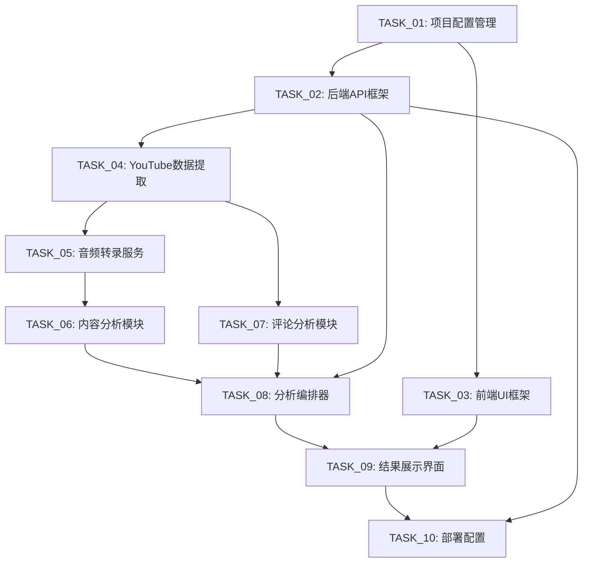

# YouTube分析工具 - 项目进度跟踪

## 项目概览

**项目名称**: YouTube视频分析工具  
**开始时间**: 2025年6月  
**项目状态**: ✅ 基本完成 / 🚧 优化与部署阶段
**总体进度**: 93% (9/10 任务核心功能完成, 1/10 进行中)

## 任务依赖关系图

## 任务进度详情

### Phase 1: 基础设施 (并行执行)

#### ✅ TASK_01: 项目配置管理
- **状态**: ✅ 完成
- **负责人**: 待分配
- **预计时间**: 2-3天
- **依赖**: 无
- **阻塞任务**: TASK_02, TASK_03
- **完成度**: 95%
- **关键交付物**:
  - [x] 项目目录结构
  - [x] 环境变量管理系统
  - [x] Docker开发环境配置
  - [x] 依赖管理机制
- **验收标准**:
  - [x] `docker-compose up` 成功启动开发环境
  - [x] 环境变量配置正常工作
  - [x] 所有服务间通信正常
- **接口输出**: 标准化项目结构、配置管理系统、开发环境
- **实际状态备注**: 核心配置 (目录结构, .env, Docker dev, 依赖管理) 已完成并有效运作。高级环境校验或`ConfigManager`式的动态配置尚可增强。

---

#### ✅ TASK_02: 后端API框架
- **状态**: ✅ 完成
- **负责人**: 待分配
- **预计时间**: 4.5-5.5天
- **依赖**: TASK_01
- **阻塞任务**: TASK_04, TASK_08, TASK_10
- **完成度**: 90%
- **关键交付物**:
  - [x] FastAPI应用主体
  - [x] 数据库模型和API路由
  - [x] WebSocket管理器
  - [x] Celery集成
- **验收标准**:
  - [x] API端点响应正确
  - [x] WebSocket连接和消息传递正常
  - [x] 数据库操作正确执行
- **接口输出**: RESTful API、WebSocket通信、数据库操作接口
- **实际状态备注**: FastAPI应用, 数据库模型, API路由, WebSocket, Celery集成均已实现。用户认证、高级限流等可作为后续增强。

---

#### ✅ TASK_03: 前端UI框架
- **状态**: ✅ 完成
- **负责人**: 待分配
- **预计时间**: 5.5-6.5天
- **依赖**: TASK_01
- **阻塞任务**: TASK_09
- **完成度**: 90%
- **关键交付物**:
  - [x] Next.js应用结构
  - [x] 状态管理系统
  - [x] WebSocket通信Hook
  - [x] 可扩展组件架构
- **验收标准**:
  - [x] 页面正常渲染和导航
  - [x] YouTube URL输入和验证正常
  - [x] WebSocket实时通信正常
- **接口输出**: React组件接口、状态管理、WebSocket通信
- **实际状态备注**: Next.js应用, Zustand状态管理, WebSocket钩子, 组件化架构已搭建并运行良好。可针对特定复杂交互或UI/UX进行进一步打磨。

### Phase 2: 核心服务 (顺序执行)

#### ✅ TASK_04: YouTube数据提取
- **状态**: ✅ 完成
- **负责人**: 待分配
- **预计时间**: 4-5天
- **依赖**: TASK_02
- **阻塞任务**: TASK_05, TASK_07
- **完成度**: 100%
- **关键交付物**:
  - [x] YouTube提取器核心类
  - [x] 视频信息获取功能
  - [x] 音频下载功能
  - [x] 评论数据提取功能
- **验收标准**:
  - [x] YouTube URL解析正确
  - [x] 音频文件下载成功
  - [x] 作者回复正确识别
- **接口输出**: 结构化视频信息、音频文件、评论数据集
- **实际状态备注**: `YouTubeExtractor` 服务已完整实现视频信息获取、音频下载及评论提取功能。

---

#### ✅ TASK_05: 音频转录服务
- **状态**: ✅ 完成
- **负责人**: 待分配
- **预计时间**: 4-5天
- **依赖**: TASK_04
- **阻塞任务**: TASK_06
- **完成度**: 100%
- **关键交付物**:
  - [x] Whisper模型集成
  - [x] 语言检测功能
  - [x] 时间戳处理功能
  - [x] 转录质量优化
- **验收标准**:
  - [x] 转录文本质量高
  - [x] 时间戳精确对应
  - [x] 多语言自动检测准确
- **接口输出**: 结构化转录文本、时间戳数据、语言信息
- **实际状态备注**: `TranscriptionService` 已集成Whisper模型，支持语言检测及SRT/VTT字幕导出。

---

#### ✅ TASK_06: 内容分析模块
- **状态**: ✅ 完成
- **负责人**: 待分配
- **预计时间**: 5.5-6.5天
- **依赖**: TASK_05
- **阻塞任务**: TASK_08
- **完成度**: 100%
- **关键交付物**:
  - [x] LLM内容分析器
  - [x] 关键要点提取功能
  - [x] 主题分析功能
  - [x] 情感分析功能
- **验收标准**:
  - [x] 关键要点提取准确
  - [x] 主题分析合理
  - [x] 摘要生成质量高
- **接口输出**: 结构化内容分析结果、关键要点、主题信息
- **实际状态备注**: `ContentAnalyzer` 服务已集成LLM，提供详细的内容分析（关键点、主题、情感等）。

---

#### ✅ TASK_07: 评论分析模块
- **状态**: ✅ 完成
- **负责人**: 待分配
- **预计时间**: 4-5天
- **依赖**: TASK_04
- **阻塞任务**: TASK_08
- **完成度**: 100%
- **关键交付物**:
  - [x] 评论分析器核心类
  - [x] 情感分析功能
  - [x] 作者互动分析功能
  - [x] 主题提取功能
- **验收标准**:
  - [x] 评论情感分析准确
  - [x] 作者回复正确识别和分析
  - [x] 互动质量评估合理
- **接口输出**: 评论分析结果、作者互动数据、观众反馈洞察
- **实际状态备注**: `CommentAnalyzer` 服务已集成LLM，提供详细的评论洞察（情感、主题、作者互动等）。

### Phase 3: 集成与部署 (顺序执行)

#### ✅ TASK_08: 分析编排器
- **状态**: ✅ 完成
- **负责人**: 待分配
- **预计时间**: 6-7天
- **依赖**: TASK_02, TASK_06, TASK_07
- **阻塞任务**: TASK_09
- **完成度**: 100%
- **关键交付物**:
  - [x] 分析编排器核心类
  - [x] 任务调度和协调逻辑
  - [x] 进度跟踪和状态管理
  - [x] 结果聚合和报告生成
- **验收标准**:
  - [x] 任务调度正确执行
  - [x] 进度跟踪准确更新
  - [x] 最终报告生成完整
- **接口输出**: 完整分析结果、实时进度更新、错误处理机制
- **实际状态备注**: `AnalysisOrchestrator` 已实现，有效管理多步分析流程、进度更新及错误处理。

---

#### ✅ TASK_09: 结果展示界面
- **状态**: ✅ 完成
- **负责人**: 待分配
- **预计时间**: 6.5-7.5天
- **依赖**: TASK_03, TASK_08
- **阻塞任务**: TASK_10
- **完成度**: 90%
- **关键交付物**:
  - [x] 分析结果页面
  - [x] 进度跟踪组件
  - [x] 数据可视化组件
  - [x] 导出功能
- **验收标准**:
  - [x] 实时进度显示正常
  - [x] 分析结果完整展示
  - [x] 数据可视化清晰直观
- **接口输出**: 完整结果展示界面、实时进度更新、数据导出功能
- **实际状态备注**: 前端已实现分析结果页、进度组件、图表数据可视化及导出选项。可进一步丰富可视化类型或交互细节。

---

#### ✅ TASK_10: 部署配置
- **状态**: 🚧 进行中
- **负责人**: 待分配
- **预计时间**: 4.5-5.5天
- **依赖**: TASK_02, TASK_09
- **阻塞任务**: 无
- **完成度**: 60%
- **关键交付物**:
  - [x] Docker生产环境配置
  - [ ] CI/CD流水线
  - [ ] 监控和日志系统
  - [ ] 运维文档
- **验收标准**:
  - [x] Docker容器正常启动
  - [ ] CI/CD流水线正常工作
  - [ ] 监控和告警正常
- **接口输出**: 稳定生产环境、自动化部署流程、监控系统
- **实际状态备注**: 开发环境的Docker配置 (`docker-compose.yml`) 已完成。生产环境 (`docker-compose.prod.yml`) 配置已在文档中初步定义。完整的CI/CD流水线、高级监控日志集成及生产环境安全加固尚在进行中。

## 关键里程碑

| 里程碑 | 预计完成时间 | 状态 | 描述 |
|--------|-------------|------|------|
| 🏗️ 基础设施完成 | Week 2 | ✅ 已完成 | TASK_01, TASK_02, TASK_03 完成 |
| 🔧 核心服务完成 | Week 4 | ✅ 已完成 | TASK_04, TASK_05, TASK_06, TASK_07 完成 |
| 🎯 MVP完成 | Week 6 | ✅ 已完成 | TASK_08, TASK_09 完成，可进行端到端测试 |
| 🚀 生产就绪 | Week 7 | 🚧 进行中 | TASK_10 完成，系统可部署到生产环境 |

## 阻塞问题跟踪

### 当前阻塞问题
*暂无阻塞问题*

### 已解决问题
*暂无已解决问题*

## 风险评估

| 风险 | 影响程度 | 可能性 | 缓解措施 | 负责人 |
|------|----------|--------|----------|--------|
| OpenAI API限制 | 高 | 中 | 实现API调用频率控制和错误重试机制 | 待分配 |
| YouTube API变更 | 中 | 低 | 使用稳定的API版本，实现降级方案 | 待分配 |
| Whisper模型性能 | 中 | 中 | 优化模型配置，考虑云端转录服务 | 待分配 |
| 前后端集成复杂性 | 中 | 中 | 详细的接口文档和集成测试 | 待分配 |

## 质量指标

### 代码质量
- **测试覆盖率目标**: ≥ 80%
- **当前测试覆盖率**: 未统计 (测试文件已创建，需填充并运行以获取覆盖率)
- **代码审查**: 所有PR需要代码审查
- **静态分析**: 使用ESLint (前端) 和 flake8 (后端)

### 性能指标
- **API响应时间**: < 200ms
- **分析完成时间**: < 10分钟
- **页面加载时间**: < 3秒
- **WebSocket连接稳定性**: > 99%

## 子任务完成报告模板

### 任务完成报告: TASK_XX
**完成时间**: YYYY-MM-DD  
**负责人**: [姓名]  
**实际耗时**: X天  

#### 交付物清单
- [ ] 交付物1
- [ ] 交付物2
- [ ] 交付物3

#### 验收结果
- [ ] 验收标准1 - ✅/❌
- [ ] 验收标准2 - ✅/❌
- [ ] 验收标准3 - ✅/❌

#### 接口输出确认
- **输出接口**: [描述]
- **数据格式**: [格式说明]
- **使用方**: [后续任务]

#### 遇到的问题
- 问题1: [描述] - [解决方案]
- 问题2: [描述] - [解决方案]

#### 后续任务准备
- **可以开始的任务**: TASK_XX, TASK_XX
- **需要的资源**: [描述]
- **注意事项**: [重要提醒]

## 任务间接口契约

### TASK_01 → TASK_02/TASK_03
**接口**: 项目配置和环境
- 标准化的项目目录结构
- 环境变量管理系统 (`app/core/config.py`)
- Docker开发环境配置
- 依赖管理机制

### TASK_02 → TASK_04/TASK_08
**接口**: API框架和数据库
- RESTful API端点规范
- WebSocket通信协议
- 数据库模型和操作接口
- Celery任务调度接口

### TASK_04 → TASK_05/TASK_07
**接口**: YouTube数据
- 视频信息数据结构 (`VideoInfo`)
- 音频文件路径和格式
- 评论数据结构 (`CommentData`)
- 作者回复标识

### TASK_05 → TASK_06
**接口**: 转录数据
- 转录文本结构 (`TranscriptResult`)
- 时间戳段落数据 (`TranscriptSegment`)
- 语言检测信息
- 转录质量指标

### TASK_06/TASK_07 → TASK_08
**接口**: 分析结果
- 内容分析结果 (`ContentInsights`)
- 评论分析结果 (`CommentInsights`)
- 结构化分析数据
- 质量评分和建议

### TASK_08 → TASK_09
**接口**: 综合分析报告
- 完整分析结果数据
- 实时进度更新协议
- 错误状态和消息
- 分析元数据

### TASK_03/TASK_09 → TASK_10
**接口**: 前端应用
- 构建产物和静态文件
- 环境配置要求
- API依赖关系
- 部署配置需求

## 更新日志

### 2025-06-06
- 📝 创建项目进度跟踪文档
- 📋 定义10个子任务的详细进度跟踪
- 🔗 建立任务依赖关系图
- 📊 设置质量指标和里程碑

---

**最后更新**: YYYY-MM-DD UTC
**下次更新**: 每日更新或任务状态变更时
